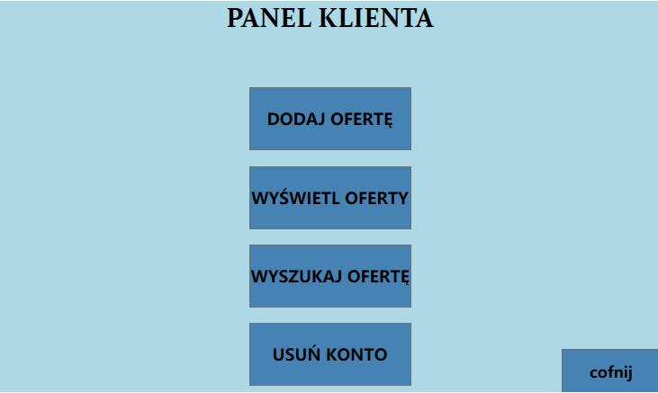
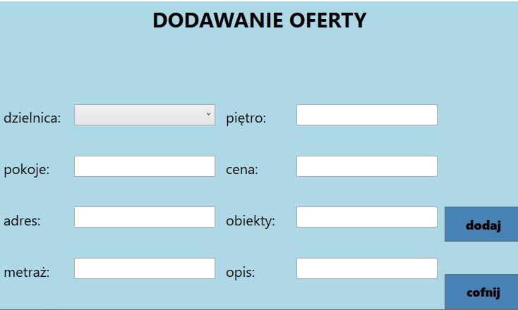

# Projekt-IO
Inteligentny pośrednik nieruchomości- prosta aplikacja WPF realizująca wybrane funckje, stworzona w ramach projektu na studia, połączona z zewnętrzną bazą MySQL.

# Zaimpelentowane funkcjonalności:
- rejestracja nowego klienta
- logowanie klienta
- wyświetlanie ofert nieruchomości należących do klienta
- dodawanie oferty nieruchomości
- usuwanie konta klienta

# Status
Projekt: zakończony

# Zrzuty ekranu:

     

     

     

